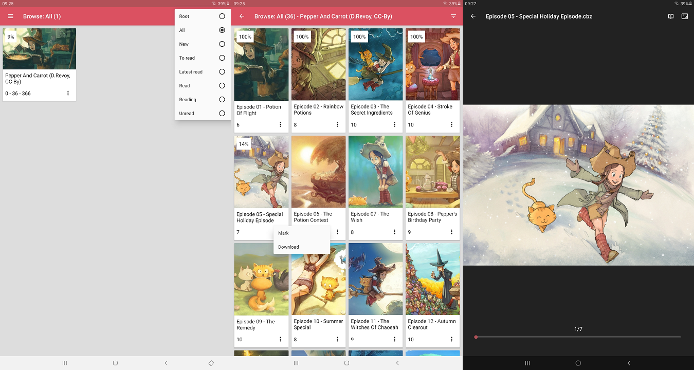

# oboco for android

oboco for android is a client for [oboco](https://gitlab.com/jeeto/oboco).
[oboco](https://gitlab.com/jeeto/oboco) is a server to help you read the books in your book collection (zip, cbz, cbr, rar, rar5).
[oboco](https://gitlab.com/jeeto/oboco) is short for "open book collection".

you can:
- read your books and book collections.
- search your books and book collections.
- download your books.
- manage your book marks.

oboco for android started as a fork of [bubble](https://github.com/nkanaev/bubble).

## requirements

- [oboco](https://gitlab.com/jeeto/oboco)
- android >= 6.0

## installation

- with [play store](https://play.google.com/store/apps/details?id=com.gitlab.jeeto.oboco)
- with chrome
	- allow installation source
		- select "settings"
		- select "biometrics and security"
		- select "install unknown apps"
		- select "chrome"
		- select "allow from this source"
	- download and install [the latest release](https://gitlab.com/jeeto/oboco-android/-/releases).

## configuration

### application ssl client

- add the ssl certificate authority (server-ca.pem) to the trust store
	- copy server-ca.pem to the device storage
	- select "settings"
	- select "biometrics and security"
	- select "other security settings"
	- select "install from device storage"

## usage

- log in
	- baseUrl: the base url of the oboco server (http://SERVER_ADDRESS:SERVER_PORT or https://SERVER_ADDRESS:SERVER_SSL_PORT)
	- name: the user name
	- password: the user password
- browse

## test

you can test oboco for android with the oboco test server (the server takes up to 30 seconds to start - retry if needed):
- log in
	- baseUrl: https://oboco-backend-test.herokuapp.com
	- name: test
	- password: test
- browse

## license

mit license